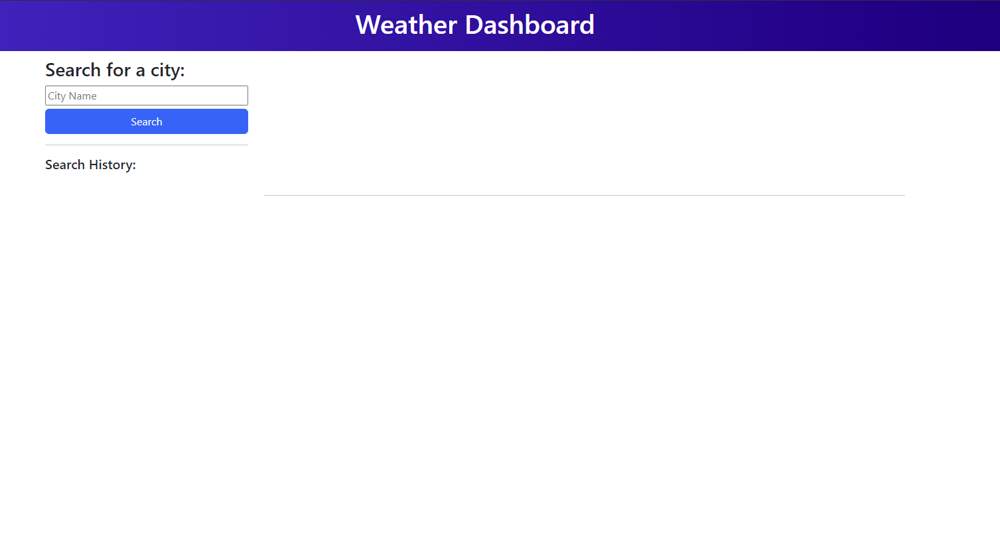
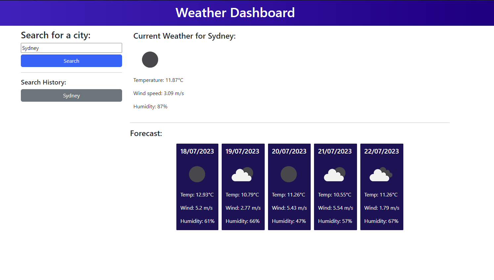

# Weather Dashboard

## Link:

https://edmond-su.github.io/Weather-Dashboard/

## Description

This project was to create a weather dashboard that will display the current weather and the forecast weather for the next 5 days of a city input by the user. This project allowed me to familiarise myself with how to use a server-side API and how to intergrate it into an application.

## Installation

N/A

## Usage

To use the weather dashboard, type in a city into the search bar on the right side of the screen and then click on the seach button below.

If the city that was input into the search was found by the api, the current weather will appear on the top section and the forecast weather will appear on the bottom section of the page. The city that was just searched will also appear in the search history. The most recently searched city will always be at the top of the search history.

## Credits

N/A

## License

N/A